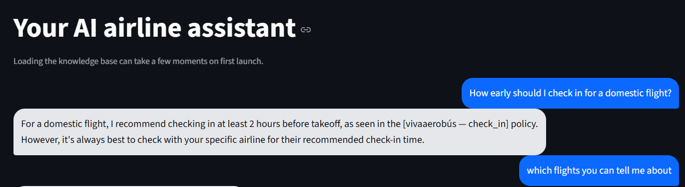

# AirAssist — AI Airline Chatbot
A production-grade RAG-powered airline assistant, not a script-based FAQ bot.


Most airline chatbots are script-based decision trees that break the moment you ask anything unexpected. AirAssist is different. It uses Retrieval-Augmented Generation with a multi-source knowledge pipeline to answer questions about IndiGo, Air India, SpiceJet, and Vistara with grounded, accurate responses.
## Demo
### Chat UI — FAQ answering with source attribution



<!-- ### Flight Search + Booking flow

 -->

## Architecture

```
+------------------------------------------- +
|               CHATBOT LAYER                |
|                                            |
| User Query                                 |
|    |                                       |
|    v                                       |
| Intent Classifier (Groq LLama 3.3 70B, t=0)|
|   /  \                                     |
|  /    \                                    |
| FAQ     Booking                            |
|  |        \                                |
|  v         Mock Booking Engine -> PNR      |
| RAG Chain -> Grounded Answer               |
|                                            |
| ConversationMemory (rolling 10-turn deque) |
+------------------------------------------- +
```
<!-- 
 -->

## Key Technical Decisions

1. Metadata-first chunking — no cross-airline contamination

Every chunk carries structured metadata before entering the vector store. Example:

```python
metadata = {
	"airline": "indigo",
	"topic": "baggage",        # auto-detected from keyword presence
	"route_type": "domestic",  # auto-detected
	"source_type": "wikipedia",
	"chunk_id": "indigo_0_12"
}
```

At query time, the retriever filters on `airline` before ranking. Air India's 23kg allowance cannot appear in an IndiGo query — structurally, not just probabilistically.

2. Hybrid retrieval — dense + sparse + re-ranking

FAISS dense vectors  → semantic meaning ("what does it cost to bring extra bags")
# AirAssist — AI Airline Chatbot (High-level)

AirAssist is a Retrieval-Augmented Generation (RAG) chatbot for airline customer support. It combines a hybrid retriever (FAISS + BM25) with a CrossEncoder reranker and a lightweight intent router to deliver grounded answers and simple booking flows.

Key highlights
- Grounded RAG answers with per-airline metadata filtering to avoid cross-airline contamination
- Hybrid retrieval + CrossEncoder reranking (results: dense 68% → hybrid 79% → hybrid + rerank 91%)
- Incremental FAISS build with checkpointing for large data resilience
- Intent routing to separate knowledge queries from action flows (mock booking engine)

Quick start (short)

1) Create and activate a virtualenv, install deps:

```bash
python -m venv .venv
.venv\Scripts\activate     # Windows
pip install -r requirements.txt
```

2) (Optional) Add API keys to `.env` from `.env.example`.

3) Build the knowledge base (one-time):

```bash
python build_knowledge_base.py
```

4) Run the app:

```bash
streamlit run app.py --server.fileWatcherType none
# Open http://localhost:8501
```

Evaluation snapshot

- Golden set (25 cases) — 21/25 passed (84%)
- Keyword hit rate: 68.5% (63/92)
- Unit tests: 57/67 (85%)

Where to find details

- Full, detailed README: [docs/README_FULL.md](docs/README_FULL.md)
- Screenshots and images: [airline-chatbot/docs/images/](airline-chatbot/docs/images/)

Contributing, license, and full run/test instructions are in the detailed docs linked above.

- RAG FAQ
- Mock booking
- Multi-turn memory

### Phase 2

- Tool-calling agents
- Live flight status
- Rebooking flows
- Refund engine

### Phase 3

- Fare alerts
- Delay prediction
- Risk scoring
- Proactive notifications

## Screenshot Upload Location

Put all README screenshots in:

- `airline-chatbot/docs/images/`

Recommended filenames:

- `chat-ui.png`
- `booking-flow.png`
- `architecture.png`
- `eval-results.png`

If you use different filenames, update the image links in this README.