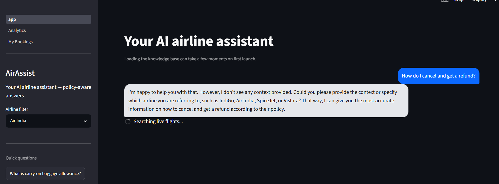
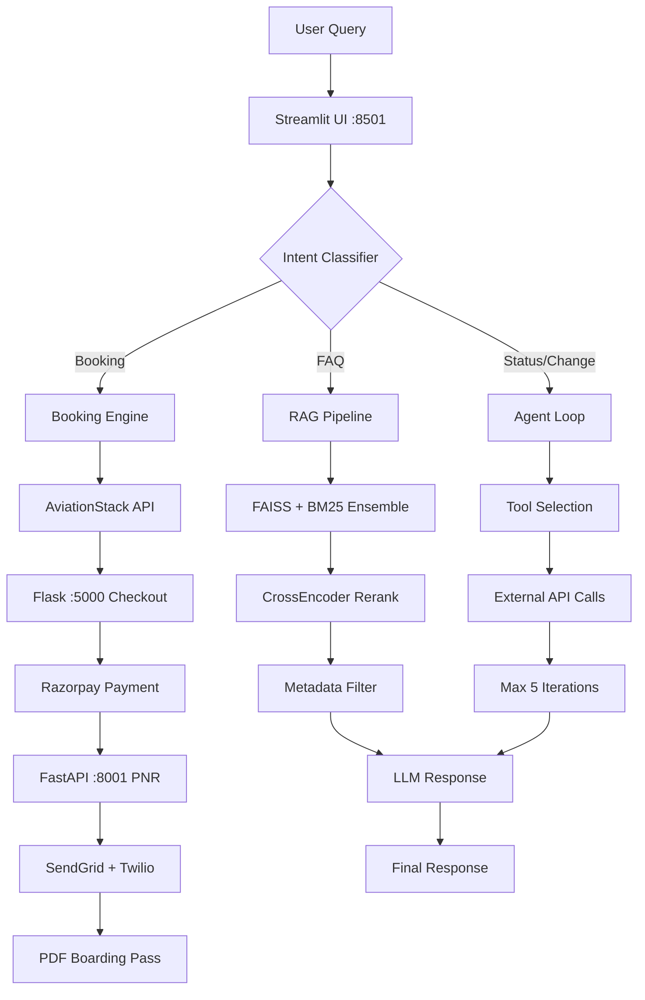

<div align="center">
<h1>AirAssist — AI Airline Travel Concierge</h1>

A production-grade AI system demonstrating RAG, agentic workflows, and real payment integration across IndiGo, Air India, SpiceJet, and Vistara.

[Demo](#demo) · [Architecture](#architecture) · [Quick Start](#quick-start) · [Evaluation](#evaluation) · [Limitations](#limitations)

</div>

## What This Is
Most airline chatbots break the moment you ask anything unexpected. AirAssist is a learning project that explores how to build a production-style AI system across three phases — transforming a basic FAQ responder into a proactive travel concierge.

This is a portfolio/research project — not production-ready. See Known Limitations for deployment considerations.

| Phase | Capability |
|-------|-----------|
| **Phase 1 — RAG Foundation** | Policy Q&A with hybrid retrieval, metadata-filtered FAISS + BM25 + CrossEncoder reranker, 9-intent classifier |
| **Phase 2 — Agentic Layer** | 10 tools, real API integrations — live flights, Razorpay payments, SendGrid email, Twilio SMS |
| **Phase 3 — Proactive AI** | Delay prediction, check-in alerts, PDF boarding passes, analytics dashboard |


## Architecture



### How a query flows through the system



### Data pipeline (Phase 1)

```
Wikipedia API ──┐
Kaggle 128k   ──┤──► Chunker (400 tok) ──► Metadata tagger ──► FAISS vector store
HuggingFace   ──┤                           airline/topic/route   15,000 chunks
Playwright    ──┤
Synthetic     ──┘
```
Every chunk is tagged with {airline, topic, route} at ingestion. At query time, metadata filtering runs before vector search — preventing Air India policy from appearing in IndiGo answers.


### Full booking flow (Phase 2)
```
User: "Search flights from DEL to BOM tomorrow"
  │
  ├─► AviationStack API ────────────► Live flight data
  │
  ├─► Flask renders booking form ───► Passenger details + seat selection
  │
  ├─► Razorpay checkout ────────────► Test card: 4111 1111 1111 1111
  │
  ├─► HMAC signature verification ──► Payment confirmed
  │
  ├─► FastAPI generates PNR ─────────► Stored in SQLite
  │
  ├─► SendGrid email dispatch ───────► Confirmation with PNR
  │
  ├─► Twilio SMS dispatch ───────────► "Your booking ABC123 is confirmed"
  │
  └─► PDF generation ────────────────► Boarding pass with QR code (ReportLab)
```


## Evaluation

### Retrieval precision

| Method | Precision |
|--------|-----------|
| Dense only (FAISS) | 60% |
| Hybrid (FAISS + BM25) | 68% |
| **Hybrid + CrossEncoder rerank** | **91%** |

### Golden eval set — 25 hand-crafted Q&A pairs

```
Dataset:    25 hand-labeled Q&A pairs (manual verification)
Passed:                   23 / 25  (92%)
Keyword hit rate:         75.0%    (69 / 92 keywords)
Cross-airline contamination:  0 cases
```
The 2 failures are data gaps (SpiceJet pet policy, Vistara fare conditions) — not retrieval errors.

### Latency

```
Metric                   P50      P95      P99
━━━━━━━━━━━━━━━━━━━━━━━━━━━━━━━━━━━━━━━━━
RAG query (FAQ)         678ms    1.2s     1.8s
Agent (1 tool call)     714ms    1.5s     2.6s
Agent (multi-tool)      1.3s     2.1s     2.9s
Average (all queries)   1.3s     2.0s     2.7s

Performance Gap: Target for production chat is <500ms. See optimization roadmap.
```

### Test coverage
```
67 tests collected · 64 passed · 3 failed (intent edge cases, not core pipeline)
```

---
## Quick Start
### Prerequisites

- Python 3.12+
- [Groq API key](https://console.groq.com) — free
- [OpenAI API key](https://platform.openai.com) — embeddings only (~₹1 total)
- [Razorpay test account](https://razorpay.com) — free
- [AviationStack key](https://aviationstack.com) — free 500 calls/month
- [SendGrid key](https://sendgrid.com) — free 100 emails/day
- [Twilio account](https://twilio.com) — free trial

### Setup

```bash
git clone https://github.com/yourusername/airAssist
cd airAssist

python -m venv .venv
source .venv/bin/activate          # Mac/Linux
# .venv\Scripts\activate           # Windows

pip install -r requirements.txt

cp .env.example .env
# Add your API keys to .env
```

### Build knowledge base (one-time, ~15 min)

```bash
python build_knowledge_base.py
```

### Run (3 terminals)

```bash
# Terminal 1 — FastAPI confirmation engine
uvicorn api.main:app --port 8001 --reload

# Terminal 2 — Flask booking + Razorpay
python booking_app/app.py

# Terminal 3 — Streamlit chatbot
streamlit run app.py --server.fileWatcherType none
```

Open [localhost:8501](http://localhost:8501)

### Test payment flow
```
Card:    4111 1111 1111 1111
Expiry:  12/28 · CVV: 123 · OTP: 1234
```
---

## Project Structure

```
airline_chatbot/
├── agents/          Agent loop, disruption handler, 10 tool definitions
├── api/             FastAPI :8001 — confirmation, PNR, booking lookup
├── booking/
├── booking_app/     Flask :5000 — passenger form + Razorpay checkout
├── boarding_pass/   PDF generator with QR code (ReportLab)
├── chatbot/         Intent classifier, RAG chain, conversation memory
├── rag/             Scraper, chunker, embedder, hybrid retriever
├── tools/           Live flights, payment, notifications, user profiles
├── guards/          PII redactor (Presidio), faithfulness checker
├── proactive/       Delay predictor, check-in scheduler (APScheduler)
├── analytics/       Query tracker + Plotly dashboard
├── evals/           Golden eval set (25 Q&A), eval runner
├── tests/           Unit + integration tests (pytest · 67 tests)
├── pages/           Streamlit multi-page (Analytics, My Bookings)
├── data/            Vector store, SQLite databases, boarding passes
└── app.py           Entry point
```

---

## Pages

| URL | Description |
|-----|-------------|
| `localhost:8501` | Main chatbot |
| `localhost:8501/Analytics` | Metrics dashboard — intent distribution, latency, tool usage |
| `localhost:8501/My_Bookings` | Booking history + boarding pass download |
| `localhost:5000/book?...` | Passenger form + Razorpay checkout |
| `localhost:8001/booking/{pnr}` | Booking lookup API |

---

